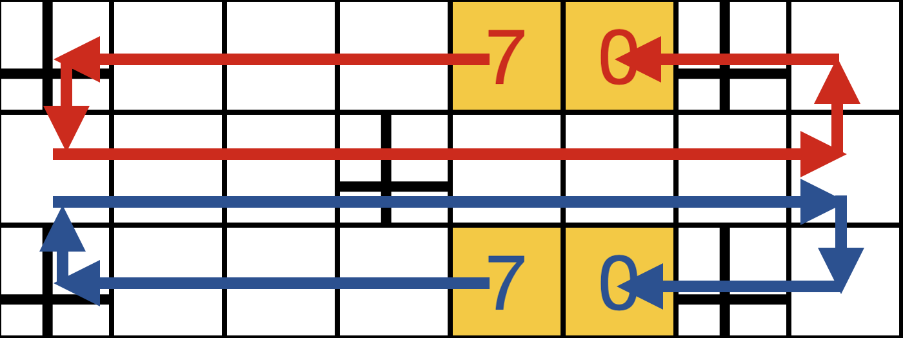

##### Table of Contents  
[The Royal Game of Ur](#game)  
- [Video Introduction by Irving Finkel](#vid)
- [Rules](#rules)
- [Play Game!](#play)
- [Strategy](#strat)

[TD-Ur](#tdur)
- [Reinforcement Learning](#rl)
- [Value Function](#value)
- [Policy](#plcy)
- [TD Learning](#td)
- [TD(lambda)](#eligibility)
- [Search](#srch)
- [Self-Play](#selfplay)
- [Implementation Details](#details)

<a name="game"/>

# The Royal Game of Ur

The Royal Game of Ur is an ancient Sumerian game, Ur being the Sumerian city in Mesapotamia, current Iraq, where the first game boards were found. 
It was played from around 2.500 BC until late antiquity, when it was replaced or evolved into Backgammon.

<a name="vid"/>

## Video Introduction by Irving Finkel

For an introduction to both the history and the rules of the game, I highly recommend this very entertaining YouTube video.
In this video, dr. Irving Finkel, curator of the British Museum and the discoverer and translator of a clay tablet from 177 BC describing the rules of the game,
explains the rules and history of the game, and plays a game against popular youtuber Tom Scott.

<a name="rules"/>

## The rules

The game is played by 2 players, on the board shown above, to the right an ancient Sumerian board and to the left my Mondriaan interpretation.
The yellow squares are not part of the board, but indicate the start (left) and finish (right) squares.
Each player starts with 7 stones, as indicated on the start square.
The crosses correspond to the "rosettes" on the original board, and have a special function as explained below.

The goal of the game is to be the first to bring all 7 stones from the start to the finish. Stones move along the route indicated in the image below.
The middle row is where the routes overlap and so where players can capture eachother's stones.

Players throw 4 tetrahedral dice with 2 corners each marked. The number of marked corners pointing up is the number of squares a single stone can be moved.
This is nothing but a fancy way of tossing 4 coins and counting the number of heads.
So the choice to make at each turn is which of your stones to move, assuming multiple moves are possible, which is not always the case.

A stone may move the rolled number of squares, _unless_ the destination square:
- is occupied by a stone of the same player
- is a rosette (marked with X) occupied by the opponent
- is off the board, to finish one must land exactly on the finish

When moving to a square occupied by the opponent, the opponent's stone is captured and moved back to the start.
When moving to a rosette square, the player gets another turn. Otherwise the turn transfers to the opponent.

Finally, when a player has no legal moves, or a 0 is thrown, they must pass. Passing is only allowed when there are no legal moves.

<a name="play"/>

## Play Game!
The easiest way to play the game against TD-Ur is to go to this link. __TODO: add link once it's public, changing the imports from drive to online__
This will run the code remotely (in a Colab notebook), which means you don't need to install anything, but also that there is a slight delay after making a move.

If you are familiar with Python you can download this repository and run the Jupyter notebook play_game.ipynb.
The dependencies are jax, numpy, matplotlib and ipywidgets.

<a name="strat"/>

## Strategy

To illustrate the types of strategic decisions the game presents, here are two game positions.

On the left board it's red's turn to move, with a throw of 2 (as indicated in the rightmost yellow squares).
Red can move 3 stones, which we label by the coordinate of the stone that is moved: 
- h3 moves that stone to the finish
- c3 moves to a rosette, giving another turn
- d2 captures the opponent's most advanced stone on f2

They all look good, but also all have downsides. Moving h3 to the finish might not be the most urgent as it is safe already. 
It also gives up the opportunity to land on the rosette with a future throw of 1.
Moving c3 to the rosette is risky, it will give the best result if the next roll of the dice is good, say another 2, but if it's bad it achieves the least.
Finally moving d2 also gives up the middle rosette, which is a strong outpost that can block the opponent's progress for the whole game if it is kept (as capture on the rosette is not allowed).

TD-Ur chose to capture with d2 here.

On the right board, it is again the red player's turn to move with a throw of 1.
There are 4 available moves
- b1 moves to a rosette and gives another turn
- b2 moves that stone closer to the finish and reduces its chance of being captured
- g3 moves that stone to the finish
- e3 puts another stone on the board
Considerations are similar here to the other board, b3 could turn out very well if the next throw is good, but we could also throw a 0, or even a 2 would be bad.
Moving g3 to the finish might not seem most urgent, but only a rather rare throw of 1 can do this, so if we postpone it for too long we might end up with our last stone stuck there.

TD-Ur chose to move g4 to the finish.

<a name="tdur"/>

# TD-Ur

We present an AI that plays Ur at human level.
Ur's successor Backgammon was the first game in which human experts were surpassed by a learned AI, called TD-Gammon by Tesauro ---cite---.
Since Ur is essentially a simplified Backgammon, it seems appropriate and sufficient to use the techniques of TD-Gammon for Ur, resulting in the TD-Ur presented here. The essential techniques are using a neural network to parametrize a value function, which is learned using TD(lambda) and a 2-3 ply lookahead.

If this means nothing to you, what follows is a quick explanation.
For more detail I recommend the book Reinforcement Learning: An Introduction, by Sutton and Barto, and these video lectures by David Silver. ---cite 2---

<a name="rl"/>

## Reinforcement Learning

Reinforcement learning is a branch of machine learning that applies to situations in which an _agent_ interacts with and receives _rewards_ from an _environment_.
In the present case, the environment is the game board and its rules, the rewards only come at the end and is simply the outcome of the game, and the agent is the AI that we want to train.

This setting is formalized into a mathematical structure called a Markov Decision Process (MDP). An MDP consists of _states_, _actions_, _rewards_ and _transition probabilities_. 
In the present case, a state consists of the board configuration, the last die roll, and whose turn it is.
In each state, there are one or more available actions to choose from, here these are the legal moves.
Upon choosing a specific action in a given state, the game moves to a new state, according to the transition probabilities for this state, action pair.
In the present case, this is a three step process:
1. deterministic consequences of the move, i.e. when the roll is 2 and the chosen stone to move is at position 4, the stone is removed from position 4 and put back at position 6, the opponent's stone is removed and put back at the start, and the turn is transferred to the opponent. The intermediate "state" after the deterministic part of the transition but before the full transition is called an _after state_.
2. The opponent rolls the dice.
3. From the point of view of the opponent, this is now a state again. But viewing it from the point of view of our agent, we don't know and can't influence what the opponent will do, so this is still part of the environment dynamics, up until the point that it's our turn and we've thrown the dice.
Of course if we land on a rosette, it is our (i.e. the agent's) turn again, and there is no step 3.
On each transition to a new state, the agent receives a reward. But in this game, there are no intermediate rewards, only a final win or loss. So the reward is 1 on the final transition to a win, and 0 otherwise.

The goal of a reinforcement learning agent is to maximize the sum of its rewards, which is also called the return, but in this case simply is the chance of winning.

<a name="value"/>

## Value Function

To maximize the return, or win probability, rather than engineering by hand, using our own knowledge of the game, complicated rules on what actions to take, in the reinforcement learning paradigm, we let the agent learn how to do it for itself.
This often involves having the agent learn a _value function_, an estimate of the expected return in the current state, or the win probability in our case.
This value function can be allowed to depend only on the current state, or also on the chosen action, when it's called an action value.
For games such as this where the transition to a new state can be decomposed into first a deterministic part and then a probabilistic part, it is convenient to choose a middle ground, namely the afterstate. So the input to our value function will be the board configuration and whose turn it is, but it does not include the dice roll, and it's not necessarily the agent's turn.

Given such an afterstate s_a obtained from the deterministic part of the transition after taking action a in state s, we want to learn to estimate a number
 <!-- 0 <= v(s_a) <= 1 -->
representing the probability of winning the game.
We will use a neural network to represent this function. A simple fully connected network with one hidden layer will do. Using a sigmoid activation function on the final layer guarantees that the value will be between 0 and 1.
Initializing the weights as random small numbers, our initial estimate will have values near 0.5, with no structure or meaning to it.

---comment info used---

<a name="plcy"/>

## Policy

The value function as presented above is not yet completely well defined, because the win probability in a given (after)state depends on the moves chosen subsequently. More formally, it depends on the _policy_ used, where a policy is a map from a state to an action, i.e. a way of choosing a move.

What we are after is the optimal policy, choosing the action that maximizes the win probability against an opponent also playing optimally.
Given the true value function assuming optimal play, we can easily obtain the optimal policy, simply by choosing the action that maximizes the afterstate value.

Of course we don't have this either, but we can work our way towards it. We start with some random value function as defined in the previous section. From this we derive a policy as above, this is called the _greedy policy_, because it maximizes the value in the next state, and does not take into consideration that to obtain the longer term maximum we might have to accept short term losses.
Then we update our estimate of the value function to more accurately reflect the win probability of this policy (see below how).
Then we use this updated value function to define a new policy in the same way.
Iterating this is called _policy iteration_, and will allow us to converge to the optimal policy and value function.

<a name="td"/>

## TD Learning

Now how do we update our estimate of the value function?
We do this using _Temporal Difference (TD) Learning_, whose basic premise is that future states have more information than present states.
The logic is that a. they are closer to the final win/loss state, and b. they have experienced more environment dynamics.
So what we can do is compute the value of the current state, ), and then take a step (using the policy whose value we're estimating), and compute the value ) there.
Assuming that the latter is more accurate, we want to update our estimate to move ) closer to ). In other words we want to minimize &space;-&space;v(S_t))^2), but only through ),. Now v is a neural network, parametrized by weights w, so we can do this using gradient descent, resulting in the weight update

&space;-&space;v(S_t))&space;\nabla_w&space;v(S_t))
<!-- w_{t+1} = w_t + \alpha (R_{t+1} + v(S_{t+1}) - v(S_t)) \nabla_w v(S_t) -->
This is called _semi-gradient descent_ because we keep the future estimate fixed. This is very important, if we do not do this we are not making use of the fact that future estimates are more accurate than present estimates.

<a name="eligibility" />

## TD(lambda)

What is described above amounts to 1-step TD, where we look one step into the future, and only update the weights according to the current state's value.
This is a usually suboptimal solution to the _credit assignment problem_, which is the problem of identifying which of the choices in the past were most responsible for the current situation.

A more elegant and usually more efficient solution to this problem is called TD(lambda).
This uses an _eligibility trace_, which is an exponentially decaying average of the gradient of the value function,

<!-- z_{t+1} = \lambda z_t + \nabla_w v -->
where lambda in (0,1) specifies the decay rate, and thus the time scale over which previous moves are considered to have an impact on the current value.
When lambda=0 we recover the previous 1-step TD, but often, and indeed in our case too, lambda=0.9 is found to be more efficient.

<a name="srch"/>

## Search

Again following TD-Gammon, we use a 2-ply search. 
A ply is a single player's move, so a one ply search would be to look at all available moves, evaluate their after states, and choose the move with the highest value after state (or lowest for the blue player).
A two ply search, as it is done in TD-Gammon and as we do here, works as follows. The afterstates found after 1-ply are not full states, they need to be supplemented with a new roll of the dice. We complete them in all possible ways, that is, with die rolls from 0 to 4.
This then forms another full state, typically with the opponent to move (unless landing on a rosette). 
For each of these states, we do another 1-ply search to find the move that is best for whoever's turn it is, and compute the value of the resulting afterstate.
So now for a given initial move, we have the 5 possible die rolls combined with the value of the best following move's after state.
We sum these up, weighted with the probability of the corresponding die roll (these probabilities are (1, 4, 6, 4, 1)/16 for throws of 0, 1, 2, 3, 4 respectively).
This gives the expected 2-ply afterstate value.
The move we choose then is the one that maximizes this value.

We do this both during training and during play after training. 

<a name="selfplay"/>

## Self-Play

So far we have described the methods by which the agent can improve through playing the game. But who does it play against?
We want it to be able to play a lot of games quickly, so its opponent should also be an AI, and we want its opponent to also grow in strength, 
it won't learn much by playing against random moves for example.

The obvious answer is that it plays itself.
This brings the risk that it will learn a strategy that works well against the same strategy but fails against another strategy it does not know.
One could train it against an ensemble of previous versions or instantiations of itself to avoid this.
Here however, due to the simplicity of Ur and the random component that brings a degree of exploration, this is unlikely to be an issue.

It can be a bit confusing to have the agent play both sides, and update its weights on all moves done during training.
To make this clearer, we have set it up so that no matter whose turn it is, we always want to improve our estimate of the value function as seen from the point of view of the red player. The eligibility vector tracks the influence of older decisions on this value function.
So neither of these, the value function or the eligibility vector, or how the updates are done, depend on whose turn it is.
The only place where this enters is that if it is the red player's turn, they will choose the move that maximizes the value function, 
while if it is the blue player's turn they will choose the move that minimizes the value function.

<a name="details"/>

## Implementation Details
Finally we discuss a few implementation details.

### Board Representation

For the board itself, internally a different representation is used, where the board is unrolled so that movement is always from left to right, 
and the middle row is duplicated, with stones always staying on their own side. 
This has several advantages. 
First of all the game logic becomes much simpler, not needing to navigate the corners of the board. 
But a second advantage is that with stones always staying on their own side, we can use simply zeros and ones for absence or presence of a stone at a particular position.
This almost makes it a binary representation, save for the start and finish values ranging between 0 and 7. 
This is clean and easy for the neural network to interpret than including negative ones for the opponent.
It might also be interesting to look at a fully binary representation, encoding the start and end values not in binary but "unary", 
so that also the norm of the feature vector is constant.
This allows us to use a heuristic to set the learning rate, inspired by linear approximations. 
- TODO explain further/remove? above
- TODO mention 32-dimensional input vector

We furthermore flip the board if necessary so that the neural network always gets fed boards where it's the red player's turn.
To always output the value function as seen from the red player's point of view, which seems the most stable, we output 1 - value if it was actually the blue player's turn.

### Jax

To speed up the training, we made heavy use of jax, which has sped it up by a factor of 100, allowing play of about 1000 moves per second on a CPU.
This involves adding `jit` decorators around often used functions, which automatically compiles them the first time they're run.
It is actually a bit more involved, but only slightly. 
For jax to be able to do this, it traces the function with abstract inputs that have only a shape and a type, but not values.
If there are conditionals on values this will fail.
So to use jax to its full extent, these conditionals should be converted as much as possible to arithmetic operations, which is what we have done.
We have also used `grad` to compute the derivative of the value function in a single line, and `vmap` to compute the values of all legal moves in one batch, 
without having to explicitly add the batch dimension in the code.

### TD error

Finally, for the final TD error, when a game is finished, we use the reward minus the previous value, rather than the reward plus the next value minus the previous value. This is because we know the total return of the final state exactly, it is simply one if we have won and zero otherwise, so there is no need to bootstrap.

### Hyperparameters
State which used for the best agent, a little bit about how searched for.
- hidden units
- learning rate
- lambda
- epsilon,
- search depth, 1 or 2

