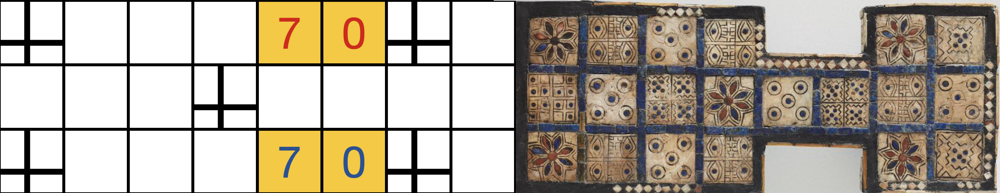
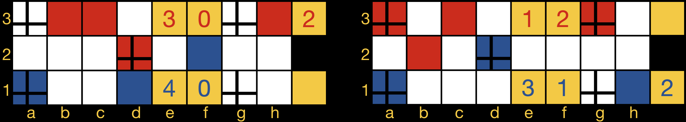
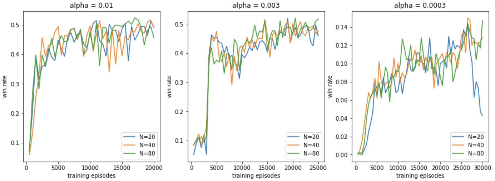

##### Table of Contents  
[The Royal Game of Ur](#game)  
- [Video Introduction by Irving Finkel](#vid)
- [Rules](#rules)
- [Play Game!](#play)
- [Strategy](#strat)

[TD-Ur](#tdur)
- [Reinforcement Learning](#rl)
- [Value Function](#value)
- [Policy](#plcy)
- [TD Learning](#td)
- [TD(lambda)](#eligibility)
- [Search](#srch)
- [Self-Play](#selfplay)
- [Implementation Details](#details)

<a name="game"/>

# The Royal Game of Ur

The Royal Game of Ur is an ancient Sumerian game, Ur being the Sumerian city in Mesapotamia, current Iraq, where the first game boards were found. 
It was played from around 2.500 BC until late antiquity, when it was replaced or evolved into Backgammon.

<a name="vid"/>

## Video Introduction by Irving Finkel

For an introduction to both the history and the rules of the game, I highly recommend this very entertaining YouTube video.
In this video, dr. Irving Finkel, curator of the British Museum and the translator of a clay tablet from 177 BC describing the rules of the game,
explains the rules and history of the game, and plays a game against popular youtuber Tom Scott.

<a name="rules"/>

## The rules

The game is played by two players, on the board shown above, to the right an ancient Sumerian board and to the left my Mondriaan interpretation.
The yellow squares are not part of the board, but indicate the start (left) and finish (right) squares.
Each player starts with 7 stones, as indicated on the start square.
The crosses correspond to the "rosettes" on the original board, and have a special function explained below.

The goal of the game is to be the first player to bring all 7 stones from the start to the finish. Stones move along the route indicated in the image below.
The middle row is where the routes overlap and players can capture eachother's stones.

Players throw 4 tetrahedral dice with 2 corners each marked. The number of marked corners pointing up is the number of squares a single stone can be moved.
This is nothing but a fancy way of tossing 4 coins and counting the number of heads.

The choice to make at each turn is which of your stones to move, assuming multiple moves are possible, which is not always the case.
A stone may move the rolled number of squares, _unless_ the destination square:
- is occupied by a stone of the same player
- is a rosette (marked with a cross) occupied by the opponent
- is off the board, to finish one must land exactly on the finish

The movement of a stone has the following consequences:
- When moving to a square occupied by the opponent, the opponent's stone is captured and moved back to the start.
- When moving to a rosette square, the player gets another turn. Otherwise the turn transfers to the opponent.

Finally, when a player has no legal moves, or a 0 is thrown, they must pass. Passing is only allowed in this situation.

<a name="play"/>

## Play Game!
The easiest way to play the game against TD-Ur is to go to click the blue button below.
Then in the pop up menu open play_Ur.ipynb and evaluate the cells by selecting them and pressing shift-enter.
This will run the code remotely (in a Google Colab notebook), which means you don't need to install anything, but also that there is a slight delay after making a move.
 

If you are familiar with Python you can download this repository and run the Jupyter notebook play_Ur_local.ipynb.
The dependencies are jax, numpy, matplotlib and ipywidgets.

<a name="strat"/>

## Strategy

To illustrate the types of strategic decisions the game presents, here are two game positions.

On the left board it's red's turn to move, with a throw of 2 (as indicated in the rightmost yellow squares).
Red can move 3 stones, labelled by the coordinate of the stone that is moved these are: 
- h3 moves that stone to the finish
- c3 moves to a rosette, giving another turn
- d2 captures the opponent's most advanced stone on f2

They all look good, but also all have downsides. Moving h3 to the finish might not be the most urgent as it is safe already. 
It also gives up the opportunity to land on the rosette with a future throw of 1.
Moving c3 to the rosette is risky, it will give the best result if the next roll of the dice is good, say another 2, but if it's bad it achieves the least.
Finally moving d2 also gives up the middle rosette, which is a strong outpost that can block the opponent's progress for the whole game if it is kept (as capture on the rosette is not allowed).

TD-Ur chose to capture with d2 here.

The right board is an illustrative example from the first game that I played against the final version of TD-Ur, where I was red and TD-Ur was blue.
It is blue's turn with a throw of 2. The possible moves are:
- e1 moving a new stone on the board
- a1 capturing a red stone
- h1 moving a stone to the finish
- d2 moving off the rosette

The last one is not worth considering, but the others are. 
Moving a stone to the finish is perhaps not the most urgent here.
Capturing the red stone seems like a good idea though. 
If we don't it has a good chance of jumping over the rosette and either escaping to the finish or forcing
us out of the middle rosette to capture it.

TD-Ur placed a new stone on the board here though, and something very interesting happened.
Notice the configuration of the red stones. On a die roll of 2, which is the most likely roll, all stones are either blocked by another stone, 
blocked by the rosette occupied by the blue player or moving too far off the board.
What happened in the game was that I threw a 2 three times in a row, not able to move, while TD-Ur filled up its starting row with the move above and further
rolls of 1 and 3. 
If TD-Ur had captured on the first move, I'd have recaptured immediately and been in a much better position.

<a name="tdur"/>

# TD-Ur

Ur's successor Backgammon was the first game in which human experts were surpassed by a self learning AI, called [TD-Gammon](https://www.csd.uwo.ca/~xling/cs346a/extra/tdgammon.pdf) by Gerald Tesauro.
Since Ur is thought to be a simpler predecessor of Backgammon, it seems appropriate and sufficient to use the techniques of TD-Gammon for Ur, resulting in the TD-Ur presented here.

Unfortunately I don't have a good way to judge TD-Ur's performance as it is not a widely played game, but I would love to hear your performance against it!
For lack of a better measure, I lost 8-2 against it. But this is clearly a way too small sample size to be meaningful, and 4 of the games were
toss-ups with both waiting for the last right die roll, 3 of which went to TD-Ur.

The essential techniques are using a neural network to parametrize a value function, which is learned using TD(lambda) and a 2-ply lookahead search.

If this means nothing to you, what follows is a basic explanation of all the techniques used.
For more detail I recommend the book [Reinforcement Learning: An Introduction](http://incompleteideas.net/book/the-book-2nd.html), by Sutton and Barto, and these [video lectures](https://www.youtube.com/watch?v=2pWv7GOvuf0&list=PLqYmG7hTraZDM-OYHWgPebj2MfCFzFObQ) by David Silver.
If it does mean something to you, at the end I comment on some implementation details and the hyperparameters used, and you are of course welcome to look at the code itself.

<a name="rl"/>

## Reinforcement Learning

Reinforcement learning is a branch of machine learning that applies to situations in which an _agent_ interacts with and receives _rewards_ from an _environment_.
In the present case, the environment is the game board and its rules, the only reward comes at the end and is simply the outcome of the game, and the agent is the AI that we want to train.

This setting is formalized into a mathematical structure called a _Markov Decision Process (MDP)_. An MDP consists of _states_, _actions_, _rewards_ and _transition probabilities_. 
In the present case, a state consists of the board configuration, the last die roll, and whose turn it is. 
This fully characterizes the current state of the game.
It is called a _Markov state_ because what happens next does not depend on how we arrived at this state, only on the state itself.

In each state, there are one or more available actions to choose from, here these are the legal moves.
Upon choosing a specific action in a given state, the game moves to a new state, according to the transition probabilities for this state, action pair.
Here this is a three step process:
1. deterministic consequences of the move, i.e. when the roll is 2 and the chosen stone to move is at position 4, the stone is removed from position 4 and put back at position 6, the opponent's stone is removed and put back at the start, and the turn is transferred to the opponent.
2. The opponent rolls the dice.
3. From the point of view of the opponent, this is now a state again. But viewing it from the point of view of our agent, we don't know and can't influence what the opponent will do, so this is still part of the environment dynamics, up until the point that it's our turn and we've thrown the dice.

Of course if we land on a rosette, it is our (i.e. the agent's) turn again, and there is no step 3.
On each transition to a new state, the agent receives a reward. But in this game, there are no intermediate rewards, only a final win or loss. So the reward is 1 on the final transition to a win, and 0 otherwise.

The goal of a reinforcement learning agent is to maximize the sum of its rewards, which is also called the return, but in this case simply is the chance of winning.

<a name="value"/>

## Value Function

To maximize the win probability in the reinforcement learning paradigm, we let the agent learn how to do it for itself.
This often involves having the agent learn a _value function_, an estimate of the expected return in the current state, or the win probability in our case.
This value function can be allowed to depend only on the current state, or also on the chosen action, when it's called an action value.

For games such as Ur, where the transition to a new state can be decomposed into first a simple deterministic part, and then an unknown part involving probability and/or the opponent's move, it is convenient to choose a middle ground.
This middle ground is called an _afterstate_, which is the intermediate "state" directly after the simple deterministic part of the transition.
Here the afterstate consists of a board configuration directly after making a move and whose turn it is, but excluding the next roll of the dice.

Given such an afterstate  obtained from the deterministic part of the transition after taking action a in state s, we want to learn to estimate a number
 <!-- 0 <= v(s_a) <= 1 -->
representing the probability of winning the game.

### Neural Network
We will use a neural network to represent this function. 
This is a convenient way to approximate a function by slowly changing a set of parameters, also called _weights_, that we will call w.

A simple fully connected network with one hidden layer will do. Using a sigmoid activation function on the final layer guarantees that the value will be between 0 and 1.
Initializing the weights as random small numbers, our initial estimate will have values near 0.5, with no structure or meaning to it.
We will see below how to slowly update this to approximate the actual win probabilities.

But first, to understand why we use a neural network for this, let's count the total number of afterstates in Ur. 
For both players, each of the 7 stones can be in one of 4 groups of squares:
- the start: 
- the finish: 
- the home row: 
- the middle row: 

Naming these as indicated above, with the subscript r indicating the red player's stones and similarly with subscript b for blue, we obtain the total number of afterstates as follows.
We sum over the number of stones at the start for both players, from 0 to 7, over the number of stones at the finish, 
again for both players from 0 up to . 
Then for both players over the number of stones in the home row from 0 to  (only to a maximum of 6 here because there are only 6 squares in the home row).
The remaining number of stones must be in the middle row.
For the home row and middle row there are multiple configurations, in each home row we have 6 squares over which to divide  stones and in the middle row we have 8 squares over which to divide  stones. 
This results in the number of afterstates:

<!-- \text{\# states}  = \sum_{s_r=0}^7\sum_{f_r=0}^{7-s_r} \sum_{h_r=0}^{6 - s_r - f_r} 
\sum_{s_b=0}^7\sum_{f_b=0}^{7-s_b} \sum_{h_b=0}^{6 - s_b - f_b} \binom{6}{h_r} \binom{6}{h_b} \binom{8}{m_r + m_b} = 
21,342,488 -->

Unlike more complicated games like Backgammon, or even worse chess or go, here this does still fit in memory.
So it _is_ possible to not use a neural network but explicitly tabulate all possible afterstates and estimate a value for each one separately.

Nevertheless, this is still not the best way to go, because there will be no generalization from states to other similar states whatsoever.
The agent will have to visit each of these states many times during training to obtain a good approximation of the value function.
In contrast, with a neural network states that are very similar will have similar values, and the network will learn which differences are important and which are not.
In this way, instead of learning a value for each afterstate separately, we only have to learn the weights of the neural network, and using only on the order of a few thousand weights will suffice.

<a name="plcy"/>

## Policy

The value function as presented above is actually not yet completely well defined, because the win probability in a given (after)state depends on the moves chosen subsequently. 
More formally, it depends on the _policy_ used, where a policy is a map from a state to an action, i.e. a way of choosing a move.

What we are after is the optimal policy, choosing the action that maximizes the win probability against an opponent also playing optimally.
Given the true value function assuming optimal play, we can easily obtain the optimal policy, simply by choosing the action that maximizes the afterstate value.

### Value Iteration

Of course we don't have this either, but we can work our way towards it. A framework for this is called _value iteration_.
This consists of alternating one step of:
1. _policy evaluation_: keeping the policy fixed and improving the estimate of its corresponding value function
2. _policy improvement_: using the estimate of its value function to improve the policy

One way of doing policy evaluation is TD learning, described below.

For the policy improvement step, we can make use of the _greedy policy_. 
This is a policy that, given a value function, simply makes the move that results in the highest value at the next state.
It is called greedy because it does not take into consideration that to obtain maximal long term rewards, it might be necessary to accept short term losses.
We apply this policy to our current estimate of the value function of the previous policy.
In tabular cases, where we parametrize the value of every state individually, this is guaranteed to improve the policy.

With a neural network approximation of the value function we lose this guarantee, because the resulting changes to the next estimate of the value function will generalize to different states. While there is no guarantee that this generalization is beneficial, in practice this still works very well.

<a name="td"/>

## TD Learning

Now how do we update our estimate of the value function?
We do this using _Temporal Difference (TD) Learning_, whose basic premise is that future states have more information than present states.
The logic is that a. they are closer to the final win/loss state, and b. they have experienced more environment dynamics.
In the extreme case for example, the game has finished and we know the outcome.

So what we can do is to compute the value of the current state ), and then play a move (using the policy whose value we're estimating), and compute the value ) there.
We have assumed that the latter is more accurate, so we want to update our estimate to move ) closer to ). In other words we want to minimize &space;-&space;v(S_t))^2), but only through ). Now v is a neural network, parametrized by weights w, so we can do this using gradient descent, resulting in the weight update

&space;-&space;v(S_t))&space;\nabla_w&space;v(S_t))
<!-- w_{t+1} = w_t + \alpha (R_{t+1} + v(S_{t+1}) - v(S_t)) \nabla_w v(S_t) -->
This is called _semi-gradient descent_ because we keep the future estimate fixed. This is very important, if we do not do this we are not making use of the fact that future estimates are more accurate than present estimates.

We have also included the reward encountered in the transition to the next state, but this is zero unless the game is finished.
The expression in brackets above is called the _TD error_.

This method is an example of _bootstrapping_: improving our estimate of the optimal value function based on earlier estimates.

<a name="eligibility" />

## TD(lambda)

What is described above amounts to 1-step TD, where we look one step into the future, and only update the weights according to the current state's value.
This is a usually suboptimal solution to the _credit assignment problem_, which is the problem of identifying which of the choices in the past were most responsible for the current situation.

A more elegant and usually more efficient solution to this problem is called TD(lambda).
This uses an _eligibility trace_, which is an exponentially decaying average of the gradient of the value function,

<!-- z_{t+1} = \lambda z_t + \nabla_w v -->
where the hyperparameter  specifies the decay rate, and thus the time scale over which previous moves are considered to have an impact on the current value. (A hyperparameter is a parameter that must be set by hand, in contrast
to the parameters w which are learned by the algorithm.)

When lambda is 0 we recover the previous 1-step TD, where only the last actions is held responsible for the result.
At the other extreme when lambda is 1, all previous actions are held equally responsible, this is called Monte Carlo learning.
Moves clearly can have a longer term effect, but at the same time the random element in the game will wash out their influence over time. 
So the optimal value is somewhere in between.

It is important to re-initialize the eligibility trace to zero at the start of each training game, as no weights have any responsibility for creating the starting state.

<a name="srch"/>

## Search

Again following TD-Gammon, we use a 2-ply search. 
A ply is a single player's move, so a one ply search would be to look at all available moves, evaluate their afterstates, and choose the move resulting in the highest value afterstate (or lowest for the blue player).
A two ply search, as it is done in TD-Gammon and as we do here, works as follows. The afterstates found after 1-ply are not full states, they need to be supplemented with a new roll of the dice. We complete them in all possible ways, that is, with die rolls from 0 to 4.
This then forms another full state, typically with the opponent to move.
For each of these states, we do another 1-ply search to find the move that is best for whoever's turn it is, and compute the value of the resulting afterstate.
So now for a given initial move, we have the 5 possible die rolls combined with the value of the best following move's afterstate.
We sum these up, weighted with the probability of the corresponding die roll (these probabilities are (1, 4, 6, 4, 1)/16 for throws of 0, 1, 2, 3, 4 respectively).
This gives the expected 2-ply afterstate value.
The move we choose then is the one that maximizes this value.

Note that there is one slight complication in Ur with respect to Backgammon, namely that the turn does not change if we land on a rosette.
This doesn't change the algorithm though, if we search for 2 ply regardless of whose move it is, and of course take care to choose the move appropriately depending on whose turn it is at either ply.

<a name="selfplay"/>

## Self-Play

So far we have described the methods by which the agent can improve through playing the game. But who does it play against?
We want it to be able to play a lot of games quickly, so its opponent should also be an AI.
We also want its opponent to also grow in strength, as it won't learn much by playing against random moves for example.

The obvious answer is that it plays itself.
This brings the risk that it will learn a strategy that works well against the same strategy but fails against another strategy it does not know.
One could train it against an ensemble of previous versions or instantiations of itself to avoid this.
Here however, due to the simplicity of Ur and the random component that brings a degree of exploration, this is unlikely to be an issue.

It can be a bit confusing to have the agent play both sides, and update its weights on all moves done during training.
To make this clearer, we have set it up so that no matter whose turn it is, 
we always want to improve our estimate of the value function as seen from the point of view of the red player. 
The eligibility trace tracks the influence of older decisions on this value function.
So neither the value function nor the eligibility trace, nor how their updates are done, depend on whose turn it is.
The only place where this enters is that if it is the red player's turn, they will choose the move that maximizes the value function, 
while if it is the blue player's turn they will choose the move that minimizes the value function.
On every move regardless of who made it we update the eligibility trace and the value function.

<a name="details"/>

## Implementation Details

### Board Representation

For the board itself, internally a different representation is used, where the board is unrolled so that movement is always from left to right.
The middle row is duplicated, with stones always staying on their own side but of course still capturing opponent stones on the other side of the region that maps to the middle row.

This simplifies the internal game logic and results in a 2 by 16 array.
The values in the array are simply zeros for absence of a stone and ones for presence, 
with the color of the stone determined by the row it is on.
The only exception are the first and last column indicating the number of stones at the start or finish, which range from 0 to 7.

Before this board is fed into the value network, it is flipped if necessary so that the network always gets fed boards where it is the red player's turn.
Then it is flatted into a 32-dimensional feature vector which is the input to the value network. This computes some value v.
To always output the value function as seen from the red player's point of view, which seems conceptually the simplest,
the final output is v if it was actually the red player's turn, and 1 - v otherwise.
This also enforces a symmetry present in the game: mirroring the board along the middle row and changin the turn results in the same state, only with the roles of red and blue reversed.

### Jax

To speed up the training, I made heavy use of jax, a Python package for automatic differentiation and fast numerical computation.
This has sped it up by a factor of 100, allowing play of about 1000 moves per second on a CPU.
This involves adding `jit` decorators around often used functions, which automatically compiles them the first time they're run.
It is actually a bit more involved, but only slightly. 
For jax to be able to do this, it traces the function with abstract inputs that have only a shape and a type, but not values.
If there are conditionals on values this will fail.
So to use jax to its full extent, these conditionals should be converted as much as possible to arithmetic operations, which is what I have done.
I have also used `grad` to compute the derivative of the value function in a single line, and `vmap` to compute the values of all legal moves in one batch, 
without having to explicitly add the batch dimension in the code.

### TD error

Finally, for the final TD error, when a game is finished, I use the reward minus the previous value, rather than the reward plus the next value minus the previous value. 
This is because at this point the return of the final state is known exactly, it is simply one if red has won and zero if blue has won, so there is no need to bootstrap.

### Initialization

It is very important not to initialize the value network's parameters too large.
In particular using Xavier initialization, appropriate for supervised learning with sigmoid activation, leads to large random initial biases that training through self-play cannot overcome.
Biases are initialized at zero and weights normally distributed, with mean zero and  standard deviation 1e-4.

### Hyperparameters
There are a number of hyperparameters in this setup, listed below with the values I tried in brackets:
- hidden units N: 40 (20, 40, 80)
- learning rate alpha: 0.01 (0.01, 0.003, 0.0003)
- lambda: 0.9 (0.5, 0.6, 0.7, 0.8, 0.9, 0.95)
- epsilon: 0 
- search depth: 2 (1, 2)

I chose these by guessing what is reasonable, and then possibly experimenting with those and some lower and higher values.

TD-Gammon used 40 or 80 units in different versions. Since Ur is much simpler than Backgammon, 40 seems reasonable, and I experimented with 20 and 80 too.

For the learning rate there is a heuristic (see Sutton & Barto), where if it is set to  where x is the feature vector, then it will take about
N visits to a similar state to fully replace the previous value. This is true for linear function approximation. While the neural network is nonlinear in the
board features, it might still be a useful guideline.
Taking N = 10 and estimating the average feature vector by using a previously trained agent gives the middle guess of alpha = 0.003.
Given the die roll probabilities in Ur, N = 10 seems low in that it will be swayed by having several lucky or unlucky throws in a row from a similar state.
However TD-Gammon used alpha = 0.1 (see [here](https://papers.nips.cc/paper/1991/file/68ce199ec2c5517597ce0a4d89620f55-Paper.pdf)), so this is a bit of a compromise, and I have tried 0.01, 0.003 and 0.0003.

For lambda, TD-Gammon used 0.7. The random element seems more important in Ur, which I think brings the optimal lambda down.
Nevertheless I experimented with a broad range of values from 0.5 to 0.95.

Epsilon is the parameter that controls the amount of exploration.
The random element of the die rolls itself already gives rise to exploration of different states, so I've just set this to 0.

I then train agents for all of the parameter combinations.
After determining a good reference agent through some competitions, the learning process can be illustrated through what are called learning curves.
These show how an agent improves with more training.
For these curves, the agent trained with a particular combination of hyperparameters competes for 1000 matches against a fixed relatively good fixed other agent.
After every 500 episodes of training, the weights are saved and the resulting agent does this competition, resulting in a win percentage as a function of the number of training episodes.
The plot below is for lambda = 0.9 and the values of N and alpha indicated.

There is a large amount of variance, mostly because of the evaluation metric, 1000 matches is still not enough to get an accurate estimate,
but also because of the performance itself, it is not guaranteed to improve with more training.
Most improvement happens in roughly the first 5000 episodes for the two larger learning rates, while the smallest is nowhere near converged yet.
Even the larger two learning rates it looks like the agents are still improving.

Another way to get some insight is with a parameter study. 
Here the final performance of a given agent is taken as the previously calculated win rate averaged over the agent's last 5000 training episodes.

These plots show that more hidden units is generally better, in the chosen range.
And for the number of episodes trained, a larger alpha is generally better.
Or in other words, more training may be beneficial.
In regards to lambda, the two lower learning rates favor higher lambda, but this may be an artifact of the limited number of training episodes,
as with a larger lambda, parameters are updated more strongly.
The curves for alpha = 0.01 suggest an intermediate value of lambda is best, though the dip at lambda = 0.7 might indicate that even here there is still
a lot of variance.

Based on these results, I've chosen N = 80 and lambda = 0.8 as the most promising candidates, and trained agents with learning rates 0.01 and 0.003
for a total of a 500,000 episodes each. 
The one with learning rate 0.01 turned out slightly better, so that is the final best agent.
It won 62.8% of its games against the reference agent (over 10,000 games).
This agent playing with a 2-ply search is what is referred to as TD-Ur.

Finally, note that all the training has been done with only a 1-ply search. 
In principle using a 2-ply search will change the training dynamics and probably improve the performance of the resulting weights when using a 2-ply 
search during actual play. However it also slows down training by a factor of about 8.
Therefore I've limited training to 1-ply search, and only used 2-ply search during actual play with a trained agent.
The best agent wins 53.5 percent of the time using 2-ply search versus itself using only a 1-ply search (over 10,000 games).
